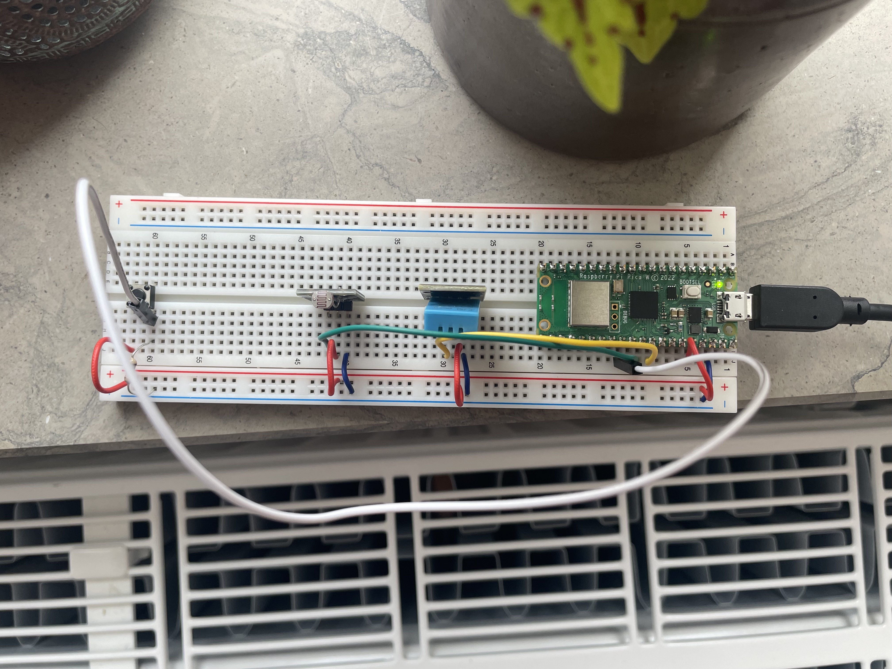
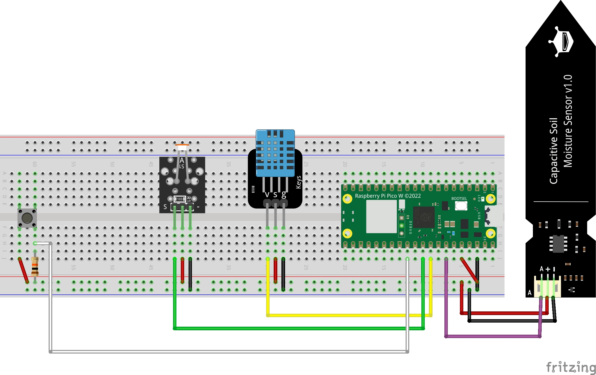

# Greeny

Tutorial on how to assemble and build an IoT device to monitor a plant's soil as well as ambient temperature and lighting conditions. 
This tutorial is part of the Applied IoT course given by Linnaeus University durnig summer 2023.
## Table of content
- [Greeny](#greeny)
  - [Table of content](#table-of-content)
  - [Author and credentials](#author-and-credentials)
  - [Description](#description)
  - [Estimated time:](#estimated-time)
  - [Objective](#objective)
  - [Material](#material)
  - [Computer setup](#computer-setup)
    - [Preparing the development environment](#preparing-the-development-environment)
    - [Preparing the Pico W for Micropython (More info here)](#preparing-the-pico-w-for-micropython-more-info-here)
    - [Uploading the code onto the Pico W](#uploading-the-code-onto-the-pico-w)
  - [Putting everything together](#putting-everything-together)
  - [Platform](#platform)
  - [The code](#the-code)
  - [Transmitting the data / connectivity](#transmitting-the-data--connectivity)
  - [Presenting the data](#presenting-the-data)
  - [Finalizing the design](#finalizing-the-design)

## Author and credentials
Name: Alexandre Rancati-Palmer
Student credentials: ar224hw

## Description
This projects aims to provide a tool to monitor a plant's soil and its environmental conditions. 
The sensors used in this project are the following: 
|Sensor name|Purpose|
|---|---|
|DHT11|Provide data on the ambient temperature and himidity|
|Capacitive soil sensor|Provide data on the humidity in the soil|
|Light sensor|Provide data on the lighting conditions|

More information about the sensors available [here](#material)
## Estimated time: 
<TODO: ADD ESTIMATED TIME>

## Objective
I am not extaclty the best gardener and I always struggle to water my plants at good time. As a responsible plant owner, I had to be better and IoT can help me reaching my goal. Beside giving me direct indication on when my plants need to be watered, I plan to use the combination of data from the environment and the soil to help me undertsand how my plants react to these different factors. When do they drink the most, in which conditions. This is more of a long term goal but with time, I hope to collect enough data to be able to map a unique hydrolic behaviour for each plant. 

## Material

|Material|Purpose|Price|Purchase|User guide|Specification|
|---|---|---|---|---|---|
|Raspberry Pico W| Micro controller with wifi chip|98 kr|[Electrokit](https://www.electrokit.com/produkt/raspberry-pi-Pico-w/)|[Raspberry website](https://www.raspberrypi.com/documentation/microcontrollers/raspberry-pi-Pico.html)|Wireless (WiFi and Bluetooth), 256kb RAM, ARM architecture, RP2040 CPU, 2Mb flash memory|
|Breadboard|For cleaner wiring|69 kr|[Electrokit](https://www.electrokit.com/produkt/kopplingsdack-840-anslutningar/)| - | - |
|Jumper cables MM|For wiring|29 kr|[Electrokit](https://www.electrokit.com/en/product/jumper-wires-1-pin-male-male-150mm-10-pack/)|-|-|
|Jumper cables MF|For wiring|29 kr|[Electrokit](https://www.electrokit.com/en/product/jumper-wires-1-pin-female-female-150mm-10-pack/)|-|-|
|USB to micro usb cable|Connecting micro controller to computer|19 kr|[Electrokit](https://www.electrokit.com/en/product/usb-cable-a-male-micro-b-male-30cm/)|-|-|
|DHT11|Temperature and humidity sensor|49 kr|[Electrokit](https://www.electrokit.com/en/product/digital-temperature-and-humidity-sensor-dht11/)|[PDF](https://www.electrokit.com/uploads/productfile/41015/41015728_-_Digital_Temperature_Humidity_Sensor.pdf)|Analog, 3.3V to 5.5V, Humidity range 20% to 90% RH with +-5% RH error. Temperature range 0°C to 50°C with +-2° error|
Capacitive Soil Sensor|Soil humidity sensor|67.99 kr|[Amazon](https://www.amazon.se/-/en/dp/B07V6M5C4H?psc=1&ref=ppx_yo2ov_dt_b_product_details)|-|Analog, 3.3V to 5.5V <TODO: Add specs>|
|Light sensor|Resistor reacting to lighting conditions|39 kr|[Electrokit](https://www.electrokit.com/produkt/ljussensor/)|[PDF](https://www.electrokit.com/uploads/productfile/41015/41015727_-_Photoresistor_Module.pdf)|Analog, 3.3V to 5.5V, built-in 10Koms resistor|
|Push button|Button for calibration of sensors|5.50 kr|[Electrokit](https://www.electrokit.com/en/product/push-button-pcb-3mm-black/)|-|-|
|1kohm resistor|Resistance to use with button|1 kr|[Electrokit](https://www.electrokit.com/en/product/resistor-carbon-film-0-25w-1kohm-1k/)|-|1Koms resistance

**Total estimated price: 406.49 kr**

<TODO: Update with latest picture>

## Computer setup
The workflow I used is on a **Mac** with **ARM architecture (M1)**. 
The steps for other OS can differ slightly, especially for Windows users. 

### Preparing the development environment
The next table provides a list of steps to run the code on the Pico W micro-controller.
The commands are to be run in a terminal. 
The links provide an alternative way to install the required software. If you do not want to use the `brew`commands, you cam skip step one and use the links to download the executable.
For the Integrated Development environment (IDE), I use Visual Studio Code (VS code) because it is higly modular and customisable as well as has a lot of community pluggins available. Moreover, it is a free software.
 
|Step|Dependency|Usage|Command|Link|
|---|---|---|---|---|
|**1**|Install Homebrew|Mac package manager|`/bin/bash -c "$(curl -fsSL https://raw.githubusercontent.com/Homebrew/install/HEAD/install.sh)"`|[Website](https://brew.sh)|
|**2**|Install Node js|Programming language - Required for IDE plugin|`brew install node`|[Brew formulae](https://formulae.brew.sh/formula/node), [Node website](https://nodejs.org/en)|
|**3**|Instal IDE: Visual studio code|Integrated Development Environment. The software we will use to program|`brew install --cask visual-studio-code`|[VS code website](https://code.visualstudio.com)|
|**4**|Install `pymakr` plugin in VS code| Plugin that will allow us to import the code to the micro controller| - | [Pymakr extension](https://marketplace.visualstudio.com/items?itemName=pycom.Pymakr)|

### Preparing the Pico W for Micropython ([More info here](https://www.raspberrypi.com/documentation/microcontrollers/micropython.html#drag-and-drop-micropython))
The Pico W, by default, does not work out of the box with micropython. We need first to upload a firmware that will allow it to map our micropython code to the hardware. 

|Step|Dependency|Usage|Command|Link|
|---|---|---|---|---|
|**1**|Download the latest micropython firmware|The envionment for the micro controller to run the code| - | [Raspberry website](https://micropython.org/download/rp2-Pico-w/rp2-Pico-w-latest.uf2)
|**2**|Maintain pressed the `BOOTSEL` button on the Pico|Enter the flash mode|-|-|
|**3**|Connect the Pico via USB to the computer|-|-|-|
|**4**|Enter the Pico Memory|This should appear similar to a usb key|-|-|
|**5**|Drag and drop the downloaded firmware at step **1** into the Pico memory|This will install the firmware|-|-|
|**6**|When the device has dissapeared, disconnect and reconnect the Pico|-|-|-|
### Uploading the code onto the Pico W
Now that the Pico W can interprate micro python code, we need to upload our code to it so that it can be executed. 

|Step|Dependency|Usage|Command|Link|
|---|---|---|---|---|
|**1**|Using the terminal, go to the folder of your choice|Select a folder for downloading the project|`cd <path/where/to/download>`| - |
|**2**|Clone the current repository|Download the code on your computer|`git clone git@github.com:alrapal/sleeptight.git` (recommended) **or** `git clone https://github.com/alrapal/sleeptight.git` |[Github repository with micropython code](https://github.com/alrapal/sleeptight/tree/main/)
|**3**|Enter the Python folder from the repository|This where the micropython code is|`cd Python`|-|
|**4**|Open the folder in VS code|This is to be able to upload the code into the controller using pymakr|`code .`|-|
||
|**3.alt**|Open the Python folder manually via VS code|It is possible that the previous command does not work and needs to be activated. In this case, you can also open the Python folder directly using VS code| - | - |
||
|**5**|

How is the device programmed. Which IDE are you using. Describe all steps from flashing the firmware, installing plugins in your favorite editor. How flashing is done on MicroPython. The aim is that a beginner should be able to understand.

- [ ] Chosen IDE
- [ ] How the code is uploaded
- [ ] Steps that you needed to do for your computer. Installation of Node.js, extra drivers, etc.

## Putting everything together
The picture below shows how the different components should be wired. 

- The Pico W micro-controller powers the breadboard via `3v3` pin (`pin 37`) 
- The Pico W connects the breadboard to ground via `pin 38`
- All sensors are then powered via the breadboard power and ground lines
- The button has a resistor connected to the ground because it is not included in unlike the other sensors. This is to avoide picking up electrical noise when not pressed. 
- Since all sensors are compatible with 5V, it is possible to use `pin 40` (`VSYS`) to power the bredboard instead of the `3v3`. This is recommended only if you plan on using the usb connector as power source since the VSYS is directly coming from the usb. It will not work if the usb is not used. This can have the benefit to provide better readings, especially for the soil sensor which, depending on the one you purchased, can provide low quality readings. 
- For data reading, all sensors are analog. This means that we use Pin 34, 32 and 31 to read the analog inputs. In the provided circuit diagram, the sensors are connected as the following: 
   
|Sensor|Pin|Pin Name|
|---|---|---|
|DHT11|`32`|`ADC1`|
|Light sensor|`31`|`ADC0`|
|Soil sensor|`34`|`ADC2`|

- The button can be connected to any `GPIO` pin since it is used to detect digital signal. In this case, it was connected to `pin 29` / `GP 22`
  
This setup is not suitable for production since it is using a bread board and the connections are not soldered. Also, it is sensitive to voltage depending on the quality of the sensor, requiring to use the USB for powering the device.  Furthermore, the wiring is exposed which can be problematic when wiring the plant. Extra care should be applied in this case, which should be avoided for production standard product. 

## Platform

Describe your choice of platform. If you have tried different platforms it can be good to provide a comparison.

Is your platform based on a local installation or a cloud? Do you plan to use a paid subscription or a free? Describe the different alternatives on going forward if you want to scale your idea.

- [ ] Describe platform in terms of functionality
- [ ] *Explain and elaborate what made you choose this platform <HIGHER GRADE>

## The code

Import core functions of your code here, and don’t forget to explain what you have done! Do not put too much code here, focus on the core functionalities. Have you done a specific function that does a calculation, or are you using clever function for sending data on two networks? Or, are you checking if the value is reasonable etc. Explain what you have done, including the setup of the network, wireless, libraries and all that is needed to understand.

## Transmitting the data / connectivity

How is the data transmitted to the internet or local server? Describe the package format. All the different steps that are needed in getting the data to your end-point. Explain both the code and choice of wireless protocols.

- [ ] How often is the data sent?
- [ ] Which wireless protocols did you use (WiFi, LoRa, etc …)?
- [ ] Which transport protocols were used (MQTT, webhook, etc …)
- [ ] *Elaborate on the design choices regarding data transmission and wireless protocols. That is how your choices affect the device range and battery consumption.
## Presenting the data

Describe the presentation part. How is the dashboard built? How long is the data preserved in the database?

- [ ] Provide visual examples on how the dashboard looks. Pictures needed.
- [ ] How often is data saved in the database.
- [ ] *Explain your choice of database. <HIGHER GRADE>
- [ ] *Automation/triggers of the data. <HIGHER GRADE>
## Finalizing the design

Show the final results of your project. Give your final thoughts on how you think the project went. What could have been done in an other way, or even better? Pictures are nice!

- [ ] Show final results of the project
- [ ] Pictures
- [ ] *Video presentation <HIGHER GRADE>

