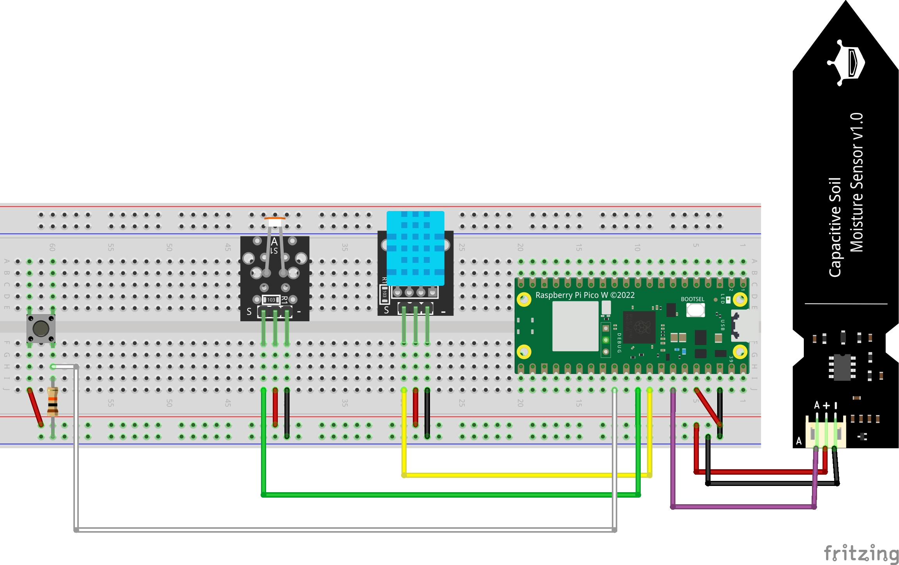

Tutorial on how to assemble and build an IoT device to monitor a plant's soil as well as ambient temperature and lighting conditions. 
This tutorial is part of the Applied IoT course evaluation given by Linnaeus University during summer 2023.
## Table of content
- [Table of content](#table-of-content)
- [Author and credentials](#author-and-credentials)
- [Description](#description)
- [Estimated time](#estimated-time)
- [Objective](#objective)
- [Material](#material)
- [Computer setup](#computer-setup)
  - [Preparing the development environment](#preparing-the-development-environment)
  - [Preparing the Pico W for Micropython (More info here)](#preparing-the-pico-w-for-micropython-more-info-here)
  - [Uploading the code onto the Pico W](#uploading-the-code-onto-the-pico-w)
- [Putting everything together](#putting-everything-together)
- [Platform](#platform)
  - [Beginner: Adafruit](#beginner-adafruit)
  - [More Advanced: TIG stack](#more-advanced-tig-stack)
- [The code](#the-code)
  - [Class Diagram](#class-diagram)
  - [AnalogSensor class](#analogsensor-class)
  - [WiFiConnector class](#wificonnector-class)
  - [MQTTclient class](#mqttclient-class)
  - [my\_secrets](#my_secrets)
  - [boot and main](#boot-and-main)
  - [Unit testing](#unit-testing)
- [Transmitting the data / connectivity](#transmitting-the-data--connectivity)
  - [Deployment diagram](#deployment-diagram)
  - [Data's journey](#datas-journey)
  - [Protocols](#protocols)
- [Presenting the data](#presenting-the-data)
- [Finalizing the design](#finalizing-the-design)


## Author and credentials
Name: Alexandre Rancati-Palmer
Student credentials: ar224hw

## Description
This projects aims to provide a tool to monitor a plant's soil and its environmental conditions. 
The sensors used in this project are the following: 
|Sensor name|Purpose|
|---|---|
|DHT11|Provide data on the ambient temperature and himidity|
|Capacitive soil sensor|Provide data on the humidity in the soil|
|Light sensor|Provide data on the lighting conditions|

More information about the sensors available [here](#material)
## Estimated time
To assemble the device and upload the code should take you around 30 minutes. 

## Objective
I am not exactly the best gardener, and I've always struggled to water my plants at the due time. As a responsible plant owner, I had to improve, and IoT can help me achieve my goal. Besides providing me with direct indications of when my plants need to be watered, I plan to utilize the combination of data from the environment and the soil to help me understand how my plants react to these different factors. When do they consume the most water, and under which conditions? This is more of a long-term objective, but over time, I hope to gather enough data to be able to identify a unique watering behavior for each plant. 

## Material

|Material|Purpose|Price|Purchase|User guide|Specification|
|---|---|---|---|---|---|
|Raspberry Pico W| Micro controller with WiFi chip|98 kr|[Electrokit](https://www.electrokit.com/produkt/raspberry-pi-Pico-w/)|[Raspberry website](https://www.raspberrypi.com/documentation/microcontrollers/raspberry-pi-Pico.html)|Wireless (**WiFi** and Bluetooth), 256kb RAM, ARM architecture, RP2040 CPU, 2Mb flash memory|
|Breadboard|For cleaner wiring|69 kr|[Electrokit](https://www.electrokit.com/produkt/kopplingsdack-840-anslutningar/)| - | - |
|Jumper cables MM|For wiring|29 kr|[Electrokit](https://www.electrokit.com/en/product/jumper-wires-1-pin-male-male-150mm-10-pack/)|-|-|
|Jumper cables MF|For wiring|29 kr|[Electrokit](https://www.electrokit.com/en/product/jumper-wires-1-pin-female-female-150mm-10-pack/)|-|-|
|USB to micro usb cable|Connecting micro controller to computer|19 kr|[Electrokit](https://www.electrokit.com/en/product/usb-cable-a-male-micro-b-male-30cm/)|-|-|
|DHT11|Temperature and humidity sensor|49 kr|[Electrokit](https://www.electrokit.com/en/product/digital-temperature-and-humidity-sensor-dht11/)|[PDF](https://www.electrokit.com/uploads/productfile/41015/41015728_-_Digital_Temperature_Humidity_Sensor.pdf)|Analog, 3.3V to 5.5V, Humidity range 20% to 90% RH with +-5% RH error. Temperature range 0°C to 50°C with +-2° error|
Capacitive Soil Sensor|Soil humidity sensor|67.99 kr|[AZ-Delivery via Amazon](https://www.amazon.se/-/en/dp/B07V6M5C4H?psc=1&ref=ppx_yo2ov_dt_b_product_details)|[Free ebook](https://www.az-delivery.de/en/products/bodenfeuchte-v1-2-kostenfreies-e-book)|Analog, 3.3V to 5V. (Although the user guide mentions only 5V, 3.3V works)|
|Light sensor|Resistor reacting to lighting conditions|39 kr|[Electrokit](https://www.electrokit.com/produkt/ljussensor/)|[PDF](https://www.electrokit.com/uploads/productfile/41015/41015727_-_Photoresistor_Module.pdf)|Analog, 3.3V to 5.5V, built-in 10Koms resistor|
|Push button|Button for manual interaction with the board|5.50 kr|[Electrokit](https://www.electrokit.com/en/product/push-button-pcb-3mm-black/)|-|-|
|1kohm resistor|Resistance to use with button|1 kr|[Electrokit](https://www.electrokit.com/en/product/resistor-carbon-film-0-25w-1kohm-1k/)|-|1Koms resistance

**Currently, the code does not use the push button. This is because of a problem with a low power consumption mode not being functionning as intended on the Pico W. When this is fixed, the button will be used to awaken from the mode and send data on a manual trigger.** 

**Total estimated price: 406.49 kr**


## Computer setup
The workflow I used is on a **Mac** with **ARM architecture (M1)**. 
The steps for other OS can differ slightly, especially for Windows users. 

### Preparing the development environment

This section aims to guide through the different steps so that you can set up the development environment and run the code on the Pico W. 
It is summarised in a table with a list of steps. 
The table provides commands to be run in the terminal for more advanced users and links for manual downloads. 

For the Integrated Development environment (IDE), we will use Visual Studio Code (VS code) because it is higly modular and customisable as well as has a lot of community pluggins available. Moreover, it is a free software.

**We first need to install the IDE in which we will code and the pluggin to be able to upload the code on the Pico W micro controller**
|Step|Dependency|Usage|Command|Link|
|---|---|---|---|---|
|**1**|Install Homebrew|Mac package manager|`/bin/bash -c "$(curl -fsSL https://raw.githubusercontent.com/Homebrew/install/HEAD/install.sh)"`|[Website](https://brew.sh)|
|**2**|Install Node js|Programming language - Required for IDE plugin|`brew install node`|[Brew formulae](https://formulae.brew.sh/formula/node), [Node website](https://nodejs.org/en)|
|**3**|Instal IDE: Visual studio code|Integrated Development Environment. The software we will use to program|`brew install --cask visual-studio-code`|[VS code website](https://code.visualstudio.com)|
|**4**|Install `pymakr` plugin in VS code| Plugin that will allow us to import the code to the micro controller| - | [Pymakr extension](https://marketplace.visualstudio.com/items?itemName=pycom.Pymakr)|

### Preparing the Pico W for Micropython ([More info here](https://www.raspberrypi.com/documentation/microcontrollers/micropython.html#drag-and-drop-micropython))
**The Pico W, by default, does not work out of the box with micropython. We need first to upload a firmware that will allow it to map our MicroPython code to the hardware. In other words, this will allow the micro controller to interpret our code and execute it**

|Step|Dependency|Usage|Command|Link|
|---|---|---|---|---|
|**1**|Download the latest MicroPython firmware for the Pico W|The envionment for the micro controller to run the code| - | [Raspberry website](https://micropython.org/download/rp2-Pico-w/rp2-Pico-w-latest.uf2)
|**2**|Maintain pressed the `BOOTSEL` button on the Pico|Enter the flash mode allowing to use the flash memory|-|-|
|**3**|Connect the Pico via USB to the computer and release the `BOOTSEL` button|-|-|-|
|**4**|Enter the Pico Memory|This should appear similar to a usb key on your system|-|-|
|**5**|Drag and drop the downloaded firmware from step **1** into the Pico memory|This will install the firmware|-|-|
|**6**|When the device has dissapeared, disconnect and reconnect the Pico|-|-|-|

**The Pico can now run your MicroPython code**
### Uploading the code onto the Pico W
**Now that the Pico W can interprate MicroPython code, we need to upload our code to it so that it can be executed. For that, we will download the code from this repository and use the IDE we have installed to upload it.**

|Step|Dependency|Usage|Command|Link|
|---|---|---|---|---|
|**1**|Using the terminal, go to the folder of your choice|Select a folder for downloading the project|`cd <path/where/to/download>`| - |
|**2**|Clone the current repository|Download the code on your computer|`git clone git@github.com:alrapal/sleeptight.git` (recommended) **or** `git clone https://github.com/alrapal/sleeptight.git` |[Github repository with MicroPython code](https://github.com/alrapal/sleeptight/tree/main/)
|**3**|Enter the MicroPython folder from the repository|This where the MicroPython code is|`cd Python`|-|
|**4**|Open the folder in VS code|This is to be able to upload the code into the controller using pymakr|`code .`|-|
||
|**3.alt**|Open the MicroPython folder manually via VS code|It is possible that the previous command does not work and needs to be activated. In this case, you can also open the MicroPython folder directly using VS code| - | - |
||
|**5**|Go to the file `change_my_secrets.py` and add your credentials on the relevant fields|This will allow the Pico to connect to the **MQTT** broker of your choice and to the **WiFi** of your choice. `ssid` is your **WiFi** network's name.|-|-|
|**6**|Rename the file as `my_secrets.py`|Otherwise the Pico will not be able to find the file.|-|-|
||
|**7**|Go to the Pymakr pluggin and add the Pico as a device for your project|This will allow you to connect the Pico for uploading the code.|-|-|
|**8**|Press the connect button|Make the connection beyween your computer and the Pico W|-|-|
|**9**|Upload the code| - |-|-|
|**10**|Disconnect the Pico W and reconnect it| This will allow the Pico to start running your code.

**Now, assuming you have have provided correct credentials for **WiFi** and **MQTT**, you should start receiving data on the feeds described in `my_secrets.py`. For the data visualisation, you have plenty of choices. More detailed on the ones I used [here](#platform).**


## Putting everything together
The picture below shows how the different components should be wired. 



- The Pico W micro-controller powers the breadboard via `3v3` pin (`pin 37`) 
- The Pico W connects the breadboard to ground via `pin 38`
- All sensors are then powered via the breadboard power and ground lines
- The button has a resistor connected to the ground because it is not included in unlike the other sensors. This is to avoide picking up electrical noise when not pressed. 
- Since all sensors are compatible with 5V, it is possible to use `pin 40` (`VBUS`) or `pin 39`(VSYS) to power the bredboard instead of the `3v3`. However, in my testings, I found that the Light sensor would provide higher values since higher voltage, but the soil moisture sensor would be constant despite having it alternatively emerged in water an dried in the air. `3.3V` seems to be recommended in this case. Or alternatively, we would need to use some extra resistors to use `VBUS` or `VSYS`. 
- For data reading, all sensors are analog. This means that we use `Pin 34`, `32` and `31` to read the analog inputs. In the provided circuit diagram, the sensors are connected as the following: 
   
|Sensor|Pin Controller Number|Pin ADC Name|Pin GPIO name|
|---|---|---|---|
|DHT11|`32`|`ADC1`|`GP27`|
|Light sensor|`31`|`ADC0`|`GP26`|
|Soil sensor|`34`|`ADC2`|`GP28`|

- The button can be connected to any `GPIO` pin since it is used to detect digital signal. In this case, it was connected to `pin 29` / `GP22`
  
This setup is not suitable for production since it is using a bread board and the connections are not soldered. Also, it is sensitive to voltage depending on the quality of the sensor, requiring to use the USB for powering the device.  Furthermore, the wiring is exposed which can be problematic when watering the plant. Extra care should be applied in this case. 

## Platform
### Beginner: Adafruit
One alternative that can be easy to start with (and which I did first) is to use some plateform like [Adafruit](https://www.adafruit.com) for data visualiation. The advantage of using those, is that we do not need to take care of setting up a **MQTT** broker, nor an interface for data visualisation. Also, the data is accessible from any network and device which is very handy if you are roaming a lot. 
On Adafruit, you create feeds that will receive the data from the Pico. You can then visualise these feeds using block which is their term for a data visualisation format. You can setup several blocks into a dashboard to have a customised visualisation. 
They provide you with the **MQTT** topics to subscribe to for each feed you create as well as credentials. The only thing is use these credentials in your Pico code (in our case, in the `my_secrets.py` file). 

We first used Adafruit because it was a fast way to test visualisation and **MQTT** connection of the Pico. But the problem is that you get limited in terms of number of topics you can publish / subscribe to as well as limited messages you can send. Moreover, you don't have any control over the broker's configuration, and if you can visualise and delete the data from Adafruit, it is still hosted on a device you have no control over. 
There is possibility to pay to get rid of these limitations but there are other solutions that can give you more benefits and control which we are talking about in [next section](#more-advanced-tig-stack).
### More Advanced: TIG stack 
As mentionned previsouly, if you want to gain more control over your data, or scale up your system by adding more devices and Pico's, it might be a good idea to use a self-hosted solution. This implies that the different software will run on a machine that you own, alowing you to customise and define the different limitations and expected behaviours for your devices. 

In my case, I chose to use the TIG-stack, which stands for `Telegraf`, `InfluxDB` and `Graphana`. 
**Telegraf** is an open source solution that collects data and report them. It will connect to our **MQTT** broker and process the message to store them to our database. 
**InfluxDB** is a scalable time-series database that efficiently stores and retrieves high volumes of time-stamped data for analysis and visualization. This makes it perfect for our use case since we are recolting time based data. 
**Graphana** Grafana is an open-source platform used to create, visualize, and analyze metrics and data from various sources through customizable dashboards and graphs. It will be ou user interface for data visualisation. 

This sounds complicated but it is made simpler by using Docker and `docker-compose`. Docker is an open-source platform that allows software developers to package and distribute applications and their dependencies into lightweight, isolated containers that can run consistently across different environments. Docker compose allows to coordinate those containers and connect them with each other, simplifying the doployement of the TIG stack in our case. 

There is a piece missing to our stack: the **MQTT** broker. You can either use an existing one provided by some third party service (but you might end up with same limitations as Adafruit's) or you can decide to create your own one. 
I went for the later and chose `mosquitto` because it is fairly simple of use. 
You can decide to include the **MQTT** broker in your Docker compose setup, but since I plan to use it for other usage as well, I decided not to. 

This setup allows me to have full control of the data and setup the broker as it fits my use case, wherease docker allows me to deploy and setup in one command my solution as well as enable compatibility with any system. 
The only drawback is that I need my computer to run to be able to store the data. also, it requires to be cautious if you plan on exposing your broker to the internet since it can make your system vulnerable, You can also run your system entirely locally if you want. More details about the data transmition is available [here](#transmitting-the-data--connectivity).

The TIG-stack I use is an updated version of the one provided for the course (using latest version of Graphana / Telegraf / InfluxDB). It is available in the `TIG-stack` folder of this repository. 
## The code
### Class Diagram

The code is build using [`MicroPython`](https://micropython.org) and relies on two different paradigm: Object Oriented Programming (OOP) and procedural programming. 
The diagram below shows how the code is articulated. 
`Pin`, `ADC` and `DHT11` are libraries included in  `MicroPython` and are not represented in the diagram for clarity (or not fully for DHT11). 


### AnalogSensor class
Since the `Greeny` project relies only on analog sensor, I decided to wrap the `ADC` class from `MicroPython` within the `AnalogSensor` class. 
This class allows better control over which pins are used since it will check the given pin agains a tuple of valid pins (Currently the 3 ADC pins that are built in with the PicoW). This  makes custom error control easier with custom exceptions that are contained in `custom_exceptions.py`, providing meaningful error messages when debuging.

**Tuple and check when calling the constructor**:
````python
valid_pico_w_analog_pins = (26,27,28) # list of the valid Pico w analog pins

class AnalogSensor():
    def __init__(self, pin, name):
        if not name.strip():
            raise InvalidSensorNameException(message="The name of the sensor should not be empty or contain only white spaces")
        if pin not in valid_pico_w_analog_pins:
            raise InvalidPinException(message="Invalid Pin provided. The valid analog pins for Pico W are 26, 27 or 28")
````

If the circuit is adapted with and ADC converter, there is just the need to update the tuple with the pins attached to the converter. Similarely, if the code is used with another micro controller, a tuple can be added with the specification of the new microcontroller.

The `AnalogSensor` class provide a standardised set of methods easy to use that allow to calibrate the sensor to retrieve a percentage based on the readings. Several checks are performed to make sure the values provided are consistent with the class' expectations. 
**Example of error handling and control of accepted data for the min value**:
````python
@min.setter
    def min(self, value: int):
        # check if the value is <= to 0 -> negatives are not allowed
        if value < 0:
            raise InvalidMinMaxException(message="The minimum boundary for " + self._name + " should be >= 0")
        # Check if the max has been defined and in that case if the value is superior or equal to the max -> there should be a gap between min and max with min < max
        if self._max is not None and value >= self._max:
            raise InvalidMinMaxException(message="The minimum boundary for " + self._name + " should be < to the maximum boundary")
        self._min = value
````

### WiFiConnector class
This class is an OOP version of the [provided file](https://hackmd.io/@lnu-iot/rJVQizwUh). It has been adapted with some extra attributes and the method to disconnect from the network. This has been done originally to be able to send a clean event to the **MQTT** broker and eventually trigger an event, giving the possibility to differenciate a clean disconnection from an unexcpected one. 

### MQTTclient class
The MQTT client class is taken from [Rui Santos](https://github.com/RuiSantosdotme), and is available [here](https://raw.githubusercontent.com/RuiSantosdotme/ESP-MicroPython/master/code/MQTT/umqttsimple.py)

The code lacks documentation but is pretty straight forward if you have **MQTT** knowledge. We use it to instanciate a client and connect it to a given broker. Then we use the client in `main` to publish messages. 

### my_secrets
A file containing all the credentials is missing from this repository. This is to avoid exposing credentials to an public place. This file contains several dictionnaries with different credientials (**WiFi**, **MQTT**) to be able to connect to the different services. 
a dummy file named `change_my_secrets.py` is provided instead. The credential to use should be put there and the file should be renamed to `my_secrets.py` to be able to connect.

### boot and main
`boot`and `main` are not classes but uses the previous classes with a procedural paradigm. 
`boot` is in charge of connecting to the **WiFi** and to the **MQTT** broker using `WifiConnector` and  `MQTTClient` and their respective methods. 
`main` is where the sensors are instanciated. It uses the `MQTTClient` in `boot` to publish the different messages to the MQTT broker. 

In `main.py`, we instanciate the ligh sensor, soil moisture sensor and DHT11 sensor. Then, we set the min and max to be able to retrieve a percentage value which is more inelligible than a raw value. To define those value, we read the raw value in both extremes conditions (raw value in sun light and in complete darkness for the light sensor and in the air and in water for the soil moisture sensor). 
However, the way the sensor work implies that the retrieve pecentage is the percentage of darkness and dryness. This is wy we reverse that percentage before sending it because it is more intuitive to the user to receive a percentage of moisture and lightning than their nemesis. 

More information about the connectivity and the data formats is available in the [next section](#transmitting-the-data--connectivity)

### Unit testing
One particular challenge is to debug embedded systems. So many different parameters can go wrong. Is the sensor broken? Is the code not working as expected? Are the broker or the client stack not working? 

To help narrow down and ease the identification of bugs, I implemented [unit tests](https://github.com/alrapal/Greeny/tree/main/MicroPython/tests) for the `AnalogSensor` class. The other classes were provided so I just assume they were working. 
However, the software is suppose to use `MicroPython` which runs on embedded devices and some libraries only available in `MicroPython`needed to be mocked to enable Continuous Integration to run them at each commit and merge request using GitHub actions.

```python
from unittest.mock import MagicMock
import unittest
from custom_exceptions import *
# Create a mock machine module since it is MicroPython dependent
mock_machine = MagicMock()
sys.modules['machine'] = mock_machine

# Create a mock time module since it is MicroPython dependent (sleep_ms)
mock_time = MagicMock()
sys.modules['time'] = mock_time
```

This helped me asserting that my methods were working as expected which, in case of unexpected readings, would help me focus my debugging efforts on the sensors or other aspects of the system. 

## Transmitting the data / connectivity
### Deployment diagram

The diagram above summarises both the different stacks and components described in section [platform](#platform) as well as the journey of the data. 
As metionned previsouly, I self host every element but my **MQTT** broker is exposed to the internet and the Pico W uses the public IP instead of the local IP. this allows to use the device on other networks and still be able to send the data to my broker. 
### Data's journey
The tipical journey of the data is the following:
- The Pico W reads the data, process it (tranforms the raw data into intelligible data) and packs it as `JSON` formatted string. It is then sent to the Mosquitto broker via **MQTT** protocol on the defined topics. Since I use a dedicated and owned broker, I can allow my message to be a bit larger. The Quality of service (QOS) is set at 1 so that the message is garanteed to be recieved by the broker. This allows to handle reset if a message is not delivered to the broker. In the case of Adafruit, the broker's configuration limited the amount of data that could be sent over time and if the connection was not active after a while, the Pico was disconnected. The board is configured to reset in such a case witch will reastablish a new connection to try to send the data. 
- The broker forward the messages to all subscribers to the topics. 
- Telegraf which is configured to automatically interprete `JSON`format, has subscribed to the topics the Pico W is sending to. It receives and processes the data and stores it into the InfluxDB database.
- InfluxDB is then answering to any query from Graphana to provided the requested data. 
- Through Graphana, the user queries and displays the results using different types of graphs, gathered in a dashboard. 

For convenience, the router has not be represented here but it acts as a gateway between the pico, the broker and the docker.
### Protocols
The Pico connects to the gateway using **WiFi**. I tested **LoRaWAN** which is a long range more energy efficient protocol but I was out of range of a gateway. In my use case, since this is a stationnary in house monitoring station powered by USB, the choice of **WiFi** is still relevant and suitable. It also allows me to use my own router as the gateway instead of relying on an external one.
If **LoRaWAN** had been available, it would have been a nice choice since it would have allowed the decive to be more portable and less energy demanding.
To compensate, I tried to use the `deepsleep` function of the Pico but it seems that it is not working properly and wakes up at random times. More investigation need to be done to fix this problem. An alternative to reduce somhow energy consumption would be to disconnect from WIFI when the messages have been sent and reconnect when we enter a new loop. This is not ideal with the current organisation of the code though, since it would not make sense anymore to connect in boot. Refactorisation would be necessary to keep the code clean and easily maintanable. 

The data is transmitted via **MQTT** protocol which is a publish/subscribe protocol. The advantage of this is that it allows distributed event driven architecture systems which are common within domotic and monitoring systems such as `Greeny`. Curently, it is sent avery 15 minutes. Depending on how the variations look like, I might go for every 30 min / hour if it is relevant. 15 minutes seems relevant as it provides insight on how fast the soil absorb the moist when the plan is watered (I water it through drainage holes). Also, to be able to train AI systems and prediction models, data is required in a subsequent amount. 

The code as been detailed in the [code section](#the-code).

## Presenting the data
The dashboard is built using **Graphana**. It consists of querying the database and associate a representation of the query result to display on the dashboard. The query language is somewhat similar to SQL language. 
The **InfluxDB** responds to the query by sending the result to **Graphana** which displays it to the dahsboard. It can be refrenshed automatically or manually. **InfluxDB** is a suitable database since it is optimised for time based events and can handle large loads of data, which in IOT can happen very quickly with data sent periodically in multiple devices. It makes it a suitable choice if the system has to scale up in the future. Furthemore, it presents high integration level with **Telegraf** which makes the data storage from the broker to the database very simple to manage. 
The data is saved as soon it receives a new message from the broker. Normally every 15 minutes. Since we only use QoS1 and not QoS2, we have no garantee that the message is delivered to **Telegraf** and thus registered to the database. It is possible that some message are lost. If it had to become problematic, we can set the QoS on the Pico to `2`. 


With **Graphana**, it is possible to setup alerts for a given query. I setup so that if the mean value of the soil moisture sensor for the last 12h is less then 15%, a message is sent on my discord server using webhooks. The check is triggered every 6h. If the check passes, a little green heart is displayed to show that the query passed the alert check. 

## Finalizing the design
This is how locally the different hosted software look like:

On the left: Graphana dashboard with the different dashboard elements.
On the down corner right: Docker desktop running **Graphana**, **Telegraf** and **InfluxDB** in containers. 
On the the top corner right: the mosquitto MQTT broker.

As you can see, the broker is open to the internet and some unauthorised client tried to connect to it. I got curious and checked the IP. It seems it is a Security Company called Censys that scann the web to provide (sell?) security solutions. It was fun to see. 

Overall this project was a lot of fun. I got to get my hands on a lot of practical cases and think about the system as a whole, from the Embedded device to the different solutions for data, processing, storage and representation. I learned about new tools as well and practiced more with other I was already familiar with. It made me finally create my own MQTT broker which I had in mind for quite some time, but lacked a use case to do it. 
If I had to do things differently, I would most likely use another language than MicroPython. Although it is a very easy to get language, I think it is somehow not very stable and reliable as I experienced inconsitencies in behaviour with exactly the same code and reproduced steps. 
I would like to redo this project using the C/C++ sdk (which is why the repository is divided in such a way to differenciate python code from other). 
On the Docker side and MQTT broker side, I might consider to include the broker inside the Docker-compose to make it very easy to deploy.
More customisation and maybe using more recent versions of the TIG stack is also on the TODO list. 

Finally, I plan on implementing some MQTT based health monitoring system of the Pico, to be able to monitor its behaviour (What were the reset causes if there were resets for instance).


